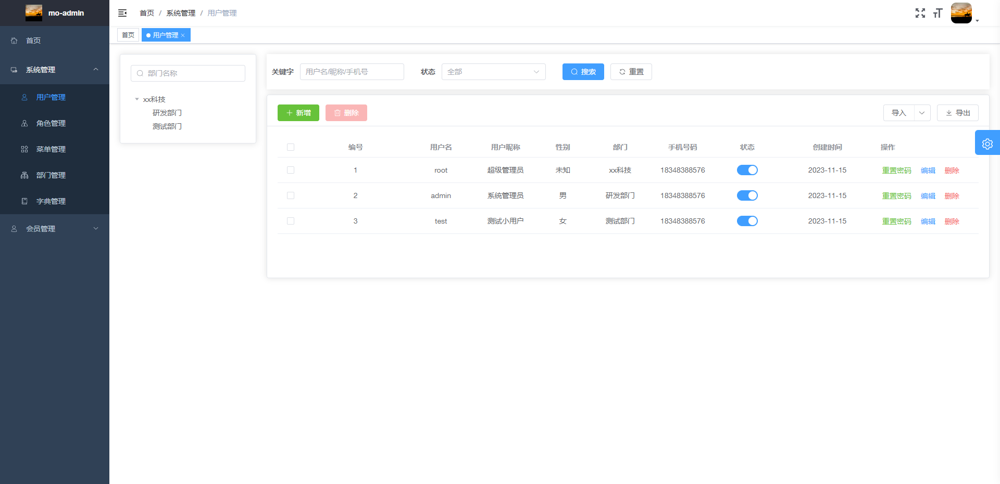
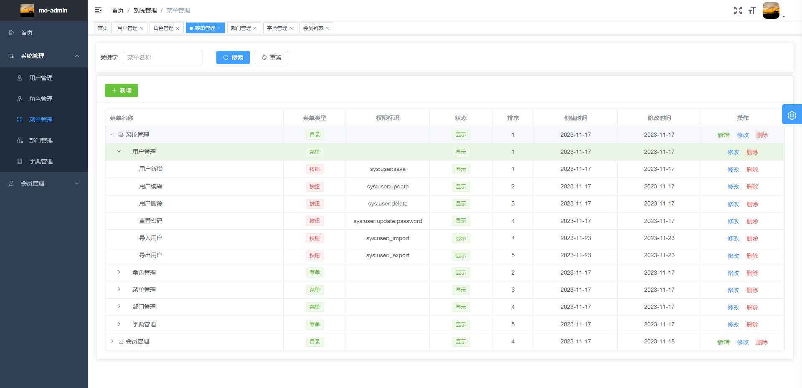

# mo-admin

> mo 管理后台，基于 vue-element-admin。

#### 项目启动

1. npm install
2. npm run dev
3. 浏览器访问 http://localhost:9527

🚨 如果因为网络问题导致 npm install 安装依赖很慢可更换为淘宝镜像源

```text
# 设置镜像源地址为淘宝
npm config set registry https://registry.npm.taobao.org
# 确认更换是否成功
npm config get registry
# 继续安装
npm install
```

#### 项目部署

- 本地打包，生成的静态文件位于项目根目录 dist 文件夹下

```text
npm run build:prod
```

- nginx.config 配置

```text
server {
      listen     80;
      server_name  localhost;

      location / {
          root /usr/local/web/mo-admin;
          index index.html index.htm;
      }

      location /prod-api/ {
          proxy_set_header X-Real-IP $remote_addr;
          proxy_set_header X-Forwarded-For $proxy_add_x_forwarded_for;
          proxy_pass http://127.0.0.1:8010/;
      }
}
```




